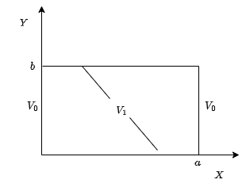
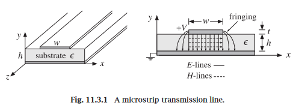

# 🎓 Master Course: Applied Electromagnetics

This repository contains analytical formulations, simulations, and computational experiments developed for the **Applied Electromagnetics course of the Master's program**.

The work spans boundary value problems, wave reflection in dielectric interfaces, waveguide propagation, and transmission line analysis — integrating both analytical methods and computational approaches.

> 👨‍🏫 **Professor**: [Prof. Dr. João Batista Rosa Silva]( http://lattes.cnpq.br/7148636278106663)

---

## 🧠 Dependencies & Libraries

The following Python libraries were used across the notebooks in this repository:

    

### ✅ Main Usage per Notebook:

| Notebook                                   | Libraries                                                          |
| ------------------------------------------- | ------------------------------------------------------------------- |
| `notebooks/electrostatic_potential.ipynb`  | NumPy 1.26.4, SymPy 1.12, Plotly 5.20.0                            |
| `notebooks/dielectric_reflection.ipynb`    | NumPy 1.26.4, Plotly 5.20.0, Math                                   |
| `notebooks/waveguide_simulation.ipynb`     | NumPy 1.26.4, Matplotlib 3.8.4, Math                                |
| `notebooks/transmission_line_analysis.ipynb`| NumPy 1.26.4, Plotly 5.20.0                                         |

---

## ⚙️ Electrostatic Potential and Electric Field Visualization

### 📌 Applications
Understanding electrostatic potential distributions is essential in designing capacitive sensors, MEMS devices, insulation systems, and electrostatic actuators used in various industries.

---

### Objective

> **(a)** Plot the electrostatic potential distribution $V(x, y)$.  
> **(b)** Plot the magnitude of the electric field $|E|$.

For two cases:  
- $n = 10$ (number of series terms)  
- $n = 50$ (number of series terms)

### 📓 Description of the notebook [`electrostatic_potential.ipynb`](notebooks/electrostatic_potential.ipynb)

This notebook develops the analytical solution for the electrostatic potential in a rectangular domain using the **method of separation of variables** applied to Laplace's equation. It includes:
- Symbolic derivation of the potential function $V(x, y)$.
- Computation and visualization of $V(x, y)$.
- Calculation and plotting of the electric field magnitude $|E(x, y)|$ derived from $\vec{E} = -\nabla V$.

---

## ⚙️ Wave Reflection on Dielectric Structures

### 📐 Reflection and Transmission Model

  

This figure illustrates the boundary conditions of an electromagnetic wave encountering a dielectric interface. The incident, reflected, and transmitted fields are represented along with their respective directions and media properties.

---

### 📌 Applications
This analysis is fundamental in designing **anti-reflection coatings**, **radar absorbing materials**, **stealth technology**, and **wireless communication systems**, where signal reflection needs to be controlled.

---

### Problem 01 — Single Dielectric Slab (Air–Dielectric–Air)

A uniform plane wave at 10 GHz is incident normally on a dielectric plate with $\epsilon_r = 3.7$, bounded by air on both sides.

> **(a)** Determine the thickness $d$ such that the input reflection coefficient is zero at 10 GHz. Repeat for 20 GHz.  
> **(b)** Plot the reflection coefficient magnitude for frequencies from 5 GHz to 30 GHz for $d = 0.9375$ cm, considering both design frequencies.

---

### Problem 02 — Dielectric Slab with Semi-Infinite Medium

  

A plane wave is incident normally on a dielectric slab of thickness $\lambda_{2_{0}}/4$ (at 10 GHz), bounded by air on one side and a semi-infinite medium with $\epsilon_{r_3} = 5.7$ on the other.

> **(a)** Compute the intrinsic impedance $\eta_2$ and dielectric constant $\epsilon_2$ to achieve zero reflection at both 10 GHz and 20 GHz.  
> **(b)** Plot the reflection coefficient magnitude for 5 GHz ≤ f ≤ 30 GHz based on the design in (a).  
> **(c)** Using the ray-tracing model, compute the first and next two higher-order contributions to the reflection coefficient at 10 GHz and 20 GHz.

---

### Problem 03 — Binomial Matching with Two Dielectric Slabs

  

Two lossless dielectric plates, each with thickness $\lambda_0/4$ at $f_0 = 10$ GHz, are placed between air and a semi-infinite medium with $\epsilon_L = 6.7$. A binomial impedance-matching design is applied with a fractional bandwidth of 0.375.

> **(a)** Calculate the intrinsic impedances, dielectric constants, and physical thicknesses needed for zero reflection at 10 GHz and 20 GHz.  
> **(b)** Determine the maximum reflection coefficient and the standing wave ratio (SWR) within the bandwidth.  
> **(c)** Plot the reflection coefficient from 5 GHz to 30 GHz, comparing the binomial design (two sections) to the single-section design.

---

### 📓 Description of the notebook [`dielectric_reflection.ipynb`](notebooks/dielectric_reflection.ipynb)

This notebook performs an analytical study of wave reflection and transmission in single and multilayer dielectric structures. It includes:
- Design of matching layers for zero reflection at specific frequencies.
- Reflection coefficient analysis over frequency ranges.
- Comparison between single-section and binomial multi-section matching techniques.
- Clear visualizations of the frequency-dependent behavior of the reflection coefficient.

---

## ⚙️ Waveguide Propagation and Simulation

### 📌 Applications
Waveguides are the backbone of high-frequency signal transmission in **radars**, **satellite communication**, **microwave circuits**, and **optical fiber technologies**. Understanding dispersion and attenuation is critical in designing low-loss, high-performance transmission systems.

---

### Problem 9.10 — WR-159 Rectangular Waveguide

> **Computer Experiment:**  
> Reproduce the plots in **Figure 9.8.2**, showing:  
> - **Power Transmission vs Frequency**  
> - **Attenuation Constant vs Frequency**  
> for the WR-159 rectangular waveguide operating in the dominant TE\(_{10}\) mode.

---

### Problem 9.11 — Dielectric Slab Waveguide

> **Computer Experiment:**  
> Reproduce all results and plots from **Examples 9.11.1 and 9.11.2**, including:
- Dispersion curves (frequency vs propagation constant $\beta$).
- Normalized parameter plots $v(u)$.
- Electric field profiles $E_y(x)$ for supported TE and TM modes.

---

### 📓 Description of the notebook [`waveguide_simulation.ipynb`](notebooks/waveguide_simulation.ipynb)

This notebook analyzes:
- Power transmission and conductor loss attenuation in rectangular waveguides.
- Computation of TE and TM mode propagation constants in dielectric slab waveguides.
- Plotting dispersion relations, normalized frequency curves, and transverse electric field distributions.
- Validation against the textbook *Electromagnetic Waves and Antennas* by **Sophocles J. Orfanidis**.

---

## ⚙️ Transmission Line Analysis

### 📐 Microstrip Transmission Line Model

  

This figure depicts the electric (E) and magnetic (H) field distributions in a microstrip transmission line, which is a common planar transmission line used in high-frequency circuits. The fringing effect of the fields in the air above the substrate is clearly visible.

---

### 📌 Applications
Transmission lines are ubiquitous in **RF circuits**, **antennas**, **microwave circuits**, and **printed circuit boards (PCBs)**. Understanding impedance matching, reflection, and signal integrity is essential for reliable and efficient communication and sensing systems.

---

### 📓 Description of the notebook [`transmission_line_analysis.ipynb`](notebooks/transmission_line_analysis.ipynb)

This notebook develops a complete analysis of transmission lines, covering theoretical modeling and computational solutions.

### 🔍 Theoretical Background

Transmission lines are described by the **Telegrapher's Equations**:

$$
\frac{\partial V(z)}{\partial z} = - (R + j\omega L) I(z)
$$

$$
\frac{\partial I(z)}{\partial z} = - (G + j\omega C) V(z)
$$

Where:
- $R$ = resistance ($\Omega/m$)
- $L$ = inductance ($H/m$)
- $G$ = conductance ($S/m$)
- $C$ = capacitance ($F/m$)

---

### 🔗 Fundamental Parameters

- **Characteristic Impedance:**

$$
Z_0 = \sqrt{\frac{R + j\omega L}{G + j\omega C}}
$$

- **Propagation Constant:**

$$
\gamma = \alpha + j\beta = \sqrt{(R + j\omega L)(G + j\omega C)}
$$

where:
- $\alpha$ = attenuation constant ($Np/m$)  
- $\beta$ = phase constant ($rad/m$)  

---

### 🔸 Input Impedance:

For a line of length $l$ terminated with a load $Z_L$:

$$
Z_{in} = Z_0 \frac{Z_L + j Z_0 \tan(\beta l)}{Z_0 + j Z_L \tan(\beta l)}
$$

---

### 🔸 Reflection Coefficient and SWR:

- **Reflection Coefficient:**

$$
\Gamma = \frac{Z_L - Z_0}{Z_L + Z_0}
$$

- **Voltage Standing Wave Ratio (SWR):**

$$
SWR = \frac{1 + |\Gamma|}{1 - |\Gamma|}
$$

---

### 📊 Notebook Features

- Frequency-domain analysis of lossless and lossy transmission lines.
- Computation of input impedance, reflection coefficient, and SWR.
- Visualization of voltage and current distributions.
- Smith chart generation for impedance matching and transformations.
- Application examples with coaxial and microstrip lines.

---

## 📚 References

- **C. A. Balanis**, _Advanced Engineering Electromagnetics_, 2nd Edition, John Wiley & Sons, 2012.  
- **Matthew N. O. Sadiku**, _Computational Electromagnetics with MATLAB_, 4th Edition, CRC Press, 2019.  
- **Sophocles J. Orfanidis**, _Electromagnetic Waves and Antennas_, Rutgers University, 2016.  
  🔍 Focus on **Chapter 9 — Waveguides**, especially Sections **9.8 and 9.11**, Examples **9.11.1, 9.11.2**, and Problems **9.10 and 9.11**.
