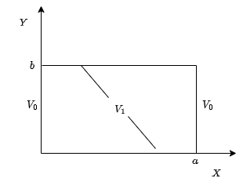

# Applied_Electromagnetics

## Task 2

To the graph below:

> **(a)** Plot the graph to $V(x,y)$
> 
> **(b)** Plot the graph to $|E|$

To values $n=10$ and $n=50$, where $a=1$ m, $b=2$ m, $V_{0}=10$ V and $V_{1} = V_{0}sin(\pi x/a) = 10sin(\pi x)$ V.

## Task 3

## Lecture about Transmission Line

## Task 4
