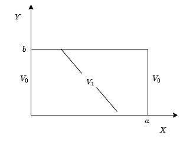
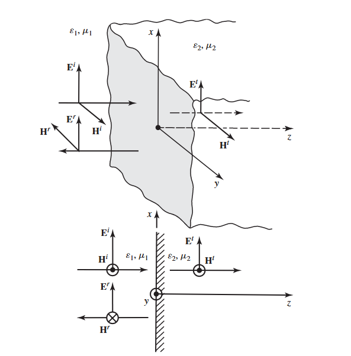
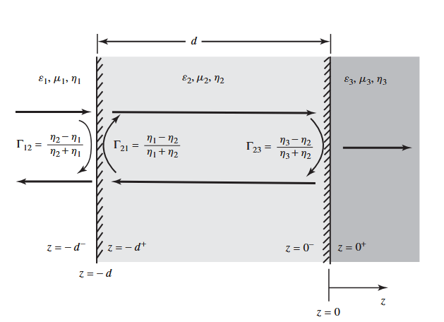
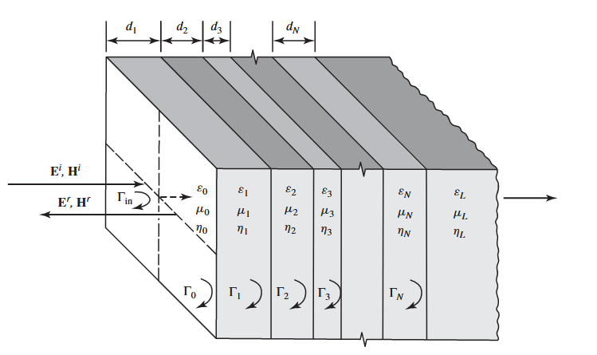
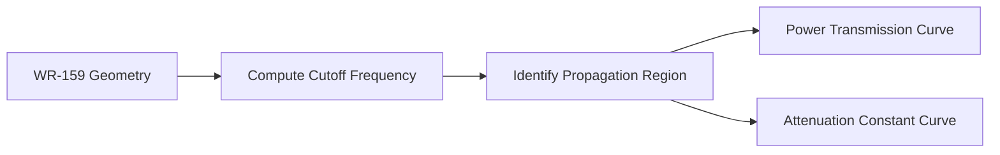
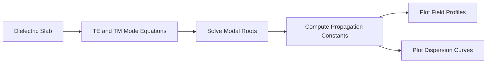
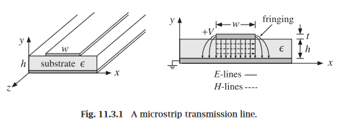
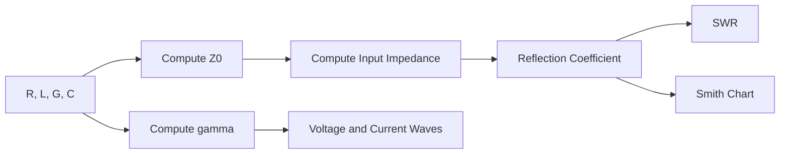

# 🎓 Master Course: Applied Electromagnetics

<p>
  
  
  
  
  
  
  
  
</p>

This repository contains analytical formulations, simulations, and computational experiments developed for the **Applied Electromagnetics course of the Master's program**.

The work covers **boundary value problems**, **electrostatic potential visualization**, **wave reflection in dielectric interfaces**, **waveguide propagation**, and **transmission line analysis**, combining classical electromagnetic theory with computational notebooks.

> 👨‍🏫 **Professor**: [Prof. Dr. João Batista Rosa Silva](http://lattes.cnpq.br/7148636278106663)  
> 🚀 **Google Colab**: All notebooks in this repository are compatible with [Google Colab](https://colab.research.google.com/). Open any `.ipynb` file in Colab to run simulations and visualizations in the cloud without local setup.

---

## 📌 Overview

This repository is an educational and computational study space for applied electromagnetics.

The main goal is to connect:

```text
analytical electromagnetic theory
boundary value problems
numerical visualization
frequency-domain simulation
wave propagation
impedance matching
transmission line modeling
```

The notebooks are designed to support both theoretical understanding and computational exploration. Each notebook starts from a physical problem, develops the mathematical model, computes relevant quantities, and visualizes the electromagnetic behavior.

---

## 🧭 Conceptual Map


```mermaid
graph TD
    em_root["Applied Electromagnetics"] --> math_model["Mathematical Models"]
    em_root --> notebooks["Computational Notebooks"]
    em_root --> physics_topics["Physical Topics"]
    em_root --> numerical_tools["Numerical Tools"]
    em_root --> visual_outputs["Visual Outputs"]

    math_model --> maxwell_eq["Maxwell Equations"]
    math_model --> laplace_eq["Laplace Equation"]
    math_model --> helmholtz_eq["Helmholtz Equation"]
    math_model --> telegrapher_eq["Telegrapher Equations"]

    physics_topics --> electrostatics["Electrostatics"]
    physics_topics --> dielectric_layers["Dielectric Interfaces"]
    physics_topics --> waveguides["Waveguides"]
    physics_topics --> transmission_lines["Transmission Lines"]

    notebooks --> nb_potential["electrostatic_potential.ipynb"]
    notebooks --> nb_reflection["dielectric_reflection.ipynb"]
    notebooks --> nb_waveguide["waveguide_simulation.ipynb"]
    notebooks --> nb_lines["transmission_line_analysis.ipynb"]

    numerical_tools --> numpy_tool["NumPy"]
    numerical_tools --> sympy_tool["SymPy"]
    numerical_tools --> plotly_tool["Plotly"]
    numerical_tools --> matplotlib_tool["Matplotlib"]

    visual_outputs --> potential_plots["Potential and Field Maps"]
    visual_outputs --> reflection_plots["Reflection Coefficient Curves"]
    visual_outputs --> dispersion_plots["Waveguide Dispersion"]
    visual_outputs --> smith_chart["Smith Chart and Line Quantities"]
```

---

## ✅ Main Usage per Notebook

| Notebook | Main Topic | Main Libraries | Description |
|---|---|---|---|
| `notebooks/electrostatic_potential.ipynb` | Electrostatic potential and electric field | NumPy, SymPy, Plotly | Solves a rectangular boundary value problem using separation of variables and visualizes $V(x,y)$ and $|E(x,y)|$. |
| `notebooks/dielectric_reflection.ipynb` | Dielectric reflection and matching layers | NumPy, Plotly, Math | Studies single-layer and multilayer dielectric matching structures over frequency. |
| `notebooks/waveguide_simulation.ipynb` | Rectangular and dielectric slab waveguides | NumPy, Matplotlib, Math | Computes waveguide propagation, attenuation, dispersion curves, and modal field profiles. |
| `notebooks/transmission_line_analysis.ipynb` | Transmission line theory and impedance matching | NumPy, Plotly | Computes characteristic impedance, propagation constant, input impedance, reflection coefficient, SWR, and related visualizations. |

---

## 📂 Repository Structure

```text
applied_electromagnetics/
│
├── images/
│   ├── potential_boundary.png
│   ├── single_interface_reflection.PNG
│   ├── three_layer_reflection.PNG
│   ├── multilayer_matching_network.PNG
│   └── microstrip_transmission_line.png
│
├── notebooks/
│   ├── electrostatic_potential.ipynb
│   ├── dielectric_reflection.ipynb
│   ├── waveguide_simulation.ipynb
│   └── transmission_line_analysis.ipynb
│
└── README.md
```

---

## 🧠 Dependencies & Libraries

The notebooks use standard scientific Python libraries.

| Library / Tool | Purpose |
|---|---|
| Python 3.x | Main programming language for the notebooks. |
| Google Colab | Cloud execution environment for notebooks. |
| NumPy 1.26.4 | Numerical arrays, vectorized computations, frequency sweeps, and field calculations. |
| SymPy 1.12 | Symbolic manipulation and analytical derivations. |
| Plotly 5.20.0 | Interactive plots, surfaces, and frequency-domain visualizations. |
| Matplotlib 3.8.4 | Static scientific plots and waveguide field profiles. |
| Python `math` | Basic mathematical functions and constants. |

---

## ▶️ Running the Notebooks

### Option 1 — Google Colab

1. Open [Google Colab](https://colab.research.google.com/).
2. Choose **File > Open notebook**.
3. Select the GitHub tab.
4. Paste the repository URL.
5. Open any notebook inside the `notebooks/` folder.
6. Run all cells.

This is the recommended option if you do not want to install dependencies locally.

---

### Option 2 — Local Jupyter Environment

Install the required libraries:

```bash
pip install numpy sympy plotly matplotlib jupyter
```

Start Jupyter:

```bash
jupyter notebook
```

Then open the desired notebook from the `notebooks/` folder.

---

## 📘 Computational Concepts

This project demonstrates several computational and electromagnetic concepts:

```text
Boundary Value Problems
Separation of Variables
Laplace Equation
Electric Field from Potential
Plane Wave Reflection
Dielectric Matching
Quarter-Wave Transformers
Binomial Matching
Transmission Lines
Waveguides
Mode Propagation
Dispersion Curves
Frequency-Domain Simulation
Interactive Visualization
```

---

# ⚡ Electromagnetic Theory Background

Applied electromagnetics studies how electric and magnetic fields behave in materials, guiding structures, circuits, and open regions.

Many problems in this repository are derived from Maxwell's equations and then reduced to specialized models depending on geometry, frequency range, and material assumptions.

## Maxwell's Equations

In differential form, Maxwell's equations are:

$$
\nabla \cdot \mathbf{D} = \rho_v
$$

$$
\nabla \cdot \mathbf{B} = 0
$$

$$
\nabla \times \mathbf{E} = -\frac{\partial \mathbf{B}}{\partial t}
$$

$$
\nabla \times \mathbf{H} = \mathbf{J} + \frac{\partial \mathbf{D}}{\partial t}
$$

where:

- $\mathbf{E}$ is the electric field intensity
- $\mathbf{H}$ is the magnetic field intensity
- $\mathbf{D}$ is the electric flux density
- $\mathbf{B}$ is the magnetic flux density
- $\rho_v$ is the volume charge density
- $\mathbf{J}$ is the current density

---

## Constitutive Relations

For simple linear media:

$$
\mathbf{D} = \epsilon \mathbf{E}
$$

$$
\mathbf{B} = \mu \mathbf{H}
$$

$$
\mathbf{J} = \sigma \mathbf{E}
$$

where:

- $\epsilon$ is the permittivity
- $\mu$ is the permeability
- $\sigma$ is the conductivity

These relations connect electromagnetic fields to material properties.

---

# ⚙️ Electrostatic Potential and Electric Field Visualization

<p align="center">
  
</p>

<p align="center">
  <em>Boundary condition geometry used for electrostatic potential visualization.</em>
</p>

## 📌 Applications

Electrostatic potential distributions are important in:

```text
capacitive sensors
MEMS devices
insulation systems
electrostatic actuators
high-voltage equipment
field-shaping electrodes
```

---

## Problem Objective

The notebook studies the electrostatic potential inside a rectangular region.

The tasks are:

```text
(a) Plot the electrostatic potential distribution V(x, y).
(b) Plot the magnitude of the electric field |E(x, y)|.
```

The computation is performed for two truncation levels:

```text
n = 10 terms
n = 50 terms
```

This allows comparison between a coarse and a more refined Fourier-series approximation.

---

## Mathematical Model

In a source-free electrostatic region, the potential satisfies Laplace's equation:

$$
\nabla^2 V = 0
$$

In two dimensions:

$$
\frac{\partial^2 V}{\partial x^2} + \frac{\partial^2 V}{\partial y^2} = 0
$$

The electric field is obtained from the potential by:

$$
\mathbf{E} = -\nabla V
$$

Therefore:

$$
E_x = -\frac{\partial V}{\partial x}
$$

$$
E_y = -\frac{\partial V}{\partial y}
$$

The field magnitude is:

$$
|E| = \sqrt{E_x^2 + E_y^2}
$$

---

## Separation of Variables Concept

The solution is expanded as a series that satisfies the boundary conditions.


```mermaid
flowchart LR
    potential_problem["Boundary Value Problem"] --> laplace_model["Laplace Equation"]
    laplace_model --> separate_vars["Separation of Variables"]
    separate_vars --> series_solution["Series Solution for V(x,y)"]
    series_solution --> gradient_calc["Compute E = -grad V"]
    gradient_calc --> field_plot["Plot V and |E|"]
```

---

## Notebook Description

[`electrostatic_potential.ipynb`](notebooks/electrostatic_potential.ipynb) develops the analytical solution for the electrostatic potential in a rectangular domain using separation of variables.

It includes:

- symbolic derivation of the potential function $V(x,y)$;
- numerical evaluation of the truncated series;
- visualization of $V(x,y)$;
- computation of the electric field components;
- plotting of the electric field magnitude $|E(x,y)|$;
- comparison between different numbers of series terms.

---

# 🌊 Wave Reflection on Dielectric Structures

Wave reflection at dielectric interfaces is fundamental in microwave engineering, optics, radar systems, antennas, and electromagnetic compatibility.

When an incident wave reaches a material discontinuity, part of the wave may be reflected and part may be transmitted. The amount of reflection depends on the intrinsic impedances of the media and on the electrical thickness of intermediate layers.

---

## 📐 Single Interface Reflection Model

<p align="center">
  
</p>

<p align="center">
  <em>Incident, reflected, and transmitted waves at a dielectric interface.</em>
</p>

At normal incidence, the reflection coefficient between two lossless media can be written as:

$$
\Gamma = \frac{\eta_2 - \eta_1}{\eta_2 + \eta_1}
$$

where $\eta_1$ and $\eta_2$ are the intrinsic impedances of the two media.

For a nonmagnetic dielectric medium:

$$
\eta = \frac{\eta_0}{\sqrt{\epsilon_r}}
$$

where $\eta_0 \approx 377\,\Omega$ is the intrinsic impedance of free space.

---

## 📌 Applications

Dielectric reflection analysis is used in:

```text
anti-reflection coatings
radar absorbing materials
stealth technology
wireless communication systems
microwave filters
radomes
multilayer optical coatings
```

---

## Problem 01 — Single Dielectric Slab

### Physical Structure

```text
Air -> Dielectric Slab -> Air
```

A uniform plane wave at 10 GHz is normally incident on a dielectric plate with:

$$
\epsilon_r = 3.7
$$

The plate is bounded by air on both sides.

### Tasks

```text
(a) Determine the slab thickness d such that the input reflection coefficient is zero at 10 GHz.
    Repeat the calculation for 20 GHz.

(b) Plot the reflection coefficient magnitude from 5 GHz to 30 GHz for d = 0.9375 cm,
    considering both design frequencies.
```

---

## Problem 02 — Dielectric Slab with Semi-Infinite Medium

<p align="center">
  
</p>

<p align="center">
  <em>Three-region structure with a dielectric matching slab and a semi-infinite load medium.</em>
</p>

### Physical Structure

```text
Air -> Dielectric Matching Slab -> Semi-Infinite Dielectric Medium
```

The final medium has:

$$
\epsilon_{r3} = 5.7
$$

The slab thickness is chosen as:

$$
d = \frac{\lambda_{20}}{4}
$$

at the design frequency.

### Tasks

```text
(a) Compute the intrinsic impedance eta_2 and dielectric constant epsilon_2
    to achieve zero reflection at both 10 GHz and 20 GHz.

(b) Plot the reflection coefficient magnitude for 5 GHz <= f <= 30 GHz.

(c) Using the ray-tracing model, compute the first and next two higher-order
    contributions to the reflection coefficient at 10 GHz and 20 GHz.
```

---

## Problem 03 — Binomial Matching with Two Dielectric Slabs

<p align="center">
  
</p>

<p align="center">
  <em>Two-section dielectric matching network between air and a load dielectric medium.</em>
</p>

### Physical Structure

```text
Air -> Slab 1 -> Slab 2 -> Semi-Infinite Dielectric Medium
```

Two lossless dielectric plates are placed between air and a semi-infinite medium with:

$$
\epsilon_L = 6.7
$$

Each plate has quarter-wave electrical thickness at:

$$
f_0 = 10\,\text{GHz}
$$

A binomial impedance-matching design is applied with fractional bandwidth:

$$
\Delta f / f_0 = 0.375
$$

### Tasks

```text
(a) Calculate the intrinsic impedances, dielectric constants, and physical thicknesses
    needed for zero reflection at 10 GHz and 20 GHz.

(b) Determine the maximum reflection coefficient and standing wave ratio within the bandwidth.

(c) Plot the reflection coefficient from 5 GHz to 30 GHz and compare the two-section
    binomial design with the single-section design.
```

---

## Dielectric Reflection Workflow


```mermaid
flowchart LR
    material_props["Material Properties"] --> impedance_calc["Compute Intrinsic Impedances"]
    impedance_calc --> layer_design["Design Matching Layers"]
    layer_design --> gamma_freq["Compute Reflection Coefficient"]
    gamma_freq --> freq_sweep["Frequency Sweep"]
    freq_sweep --> compare_designs["Compare Single and Multilayer Designs"]
```

---

## Notebook Description

[`dielectric_reflection.ipynb`](notebooks/dielectric_reflection.ipynb) performs an analytical and computational study of wave reflection and transmission in dielectric structures.

It includes:

- design of matching layers for zero reflection at specific frequencies;
- computation of intrinsic impedances and dielectric constants;
- reflection coefficient analysis over frequency ranges;
- comparison between single-section and binomial multi-section matching techniques;
- ray-tracing interpretation of multiple reflected waves;
- interactive visualizations of $|\Gamma(f)|$.

---

# 📡 Waveguide Propagation and Simulation

Waveguides are structures that guide electromagnetic waves by imposing boundary conditions that support discrete propagation modes.

They are especially important at microwave and millimeter-wave frequencies, where ordinary two-conductor lines may become inefficient or difficult to manufacture.

---

## 📌 Applications

Waveguides are used in:

```text
radar systems
satellite communication
microwave links
antenna feeds
high-power RF transmission
microwave measurement systems
optical slab waveguides
integrated photonics
```

---

## Rectangular Waveguide Concepts

In a rectangular metallic waveguide, only certain modes can propagate above their cutoff frequencies.

For a rectangular waveguide with dimensions $a$ and $b$, the cutoff frequency of a TE or TM mode is:

$$
f_{c,mn} = \frac{1}{2\sqrt{\mu\epsilon}}\sqrt{\left(\frac{m}{a}\right)^2 + \left(\frac{n}{b}\right)^2}
$$

The dominant mode of a standard rectangular waveguide is usually:

$$
TE_{10}
$$

The propagation constant is:

$$
\beta = \sqrt{k^2 - k_c^2}
$$

where:

- $k$ is the wavenumber in the filling medium
- $k_c$ is the cutoff wavenumber
- $\beta$ is the longitudinal phase constant

---

## Problem 9.10 — WR-159 Rectangular Waveguide

### Computer Experiment

Reproduce the plots in Figure 9.8.2 for the WR-159 rectangular waveguide operating in the dominant $TE_{10}$ mode.

The required plots are:

```text
Power Transmission vs Frequency
Attenuation Constant vs Frequency
```

### Conceptual Flow


```mermaid
flowchart LR
    wg_geometry["WR-159 Geometry"] --> cutoff_freq["Compute Cutoff Frequency"]
    cutoff_freq --> propagation_region["Identify Propagation Region"]
    propagation_region --> power_curve["Power Transmission Curve"]
    propagation_region --> attenuation_curve["Attenuation Constant Curve"]
```

---

## Problem 9.11 — Dielectric Slab Waveguide

### Computer Experiment

Reproduce all results and plots from Examples 9.11.1 and 9.11.2.

The notebook includes:

```text
Dispersion curves: frequency vs propagation constant beta
Normalized parameter plots v(u)
Electric field profiles E_y(x)
Supported TE modes
Supported TM modes
```

### Slab Waveguide Concept

A dielectric slab waveguide confines electromagnetic energy through total internal reflection and modal boundary conditions.


```mermaid
flowchart LR
    slab_structure["Dielectric Slab"] --> mode_equations["TE and TM Mode Equations"]
    mode_equations --> root_solving["Solve Modal Roots"]
    root_solving --> beta_values["Compute Propagation Constants"]
    beta_values --> field_profiles["Plot Field Profiles"]
    beta_values --> dispersion_curves["Plot Dispersion Curves"]
```

---

## Notebook Description

[`waveguide_simulation.ipynb`](notebooks/waveguide_simulation.ipynb) analyzes wave propagation in metallic and dielectric waveguides.

It includes:

- power transmission in rectangular waveguides;
- conductor loss attenuation calculations;
- cutoff frequency analysis;
- computation of TE and TM propagation constants;
- dielectric slab waveguide modal equations;
- dispersion relation plots;
- normalized frequency diagrams;
- transverse electric field distributions;
- validation against examples and problems from *Electromagnetic Waves and Antennas* by Sophocles J. Orfanidis.

---

# 🔌 Transmission Line Analysis

Transmission lines are distributed electromagnetic systems used to guide signals when the physical length of an interconnect is comparable to the wavelength of operation.

At RF and microwave frequencies, voltage and current must be modeled as waves rather than lumped quantities.

---

## 📐 Microstrip Transmission Line Model

<p align="center">
  
</p>

<p align="center">
  <em>Electric and magnetic field distribution around a microstrip transmission line.</em>
</p>

---

## 📌 Applications

Transmission line analysis is essential in:

```text
RF circuits
microwave circuits
antennas
printed circuit boards
coaxial cables
microstrip and stripline design
impedance matching
signal integrity analysis
```

---

## Telegrapher's Equations

Transmission lines are described by the Telegrapher's equations:

$$
\frac{\partial V(z)}{\partial z} = - (R + j\omega L) I(z)
$$

$$
\frac{\partial I(z)}{\partial z} = - (G + j\omega C) V(z)
$$

where:

- $R$ is the resistance per unit length in $\Omega/m$
- $L$ is the inductance per unit length in $H/m$
- $G$ is the conductance per unit length in $S/m$
- $C$ is the capacitance per unit length in $F/m$

---

## Fundamental Parameters

### Characteristic Impedance

$$
Z_0 = \sqrt{\frac{R + j\omega L}{G + j\omega C}}
$$

### Propagation Constant

$$
\gamma = \alpha + j\beta = \sqrt{(R + j\omega L)(G + j\omega C)}
$$

where:

- $\alpha$ is the attenuation constant in $Np/m$
- $\beta$ is the phase constant in $rad/m$

---

## Input Impedance

For a line of length $l$ terminated with load impedance $Z_L$:

$$
Z_{in} = Z_0 \frac{Z_L + j Z_0 \tan(\beta l)}{Z_0 + j Z_L \tan(\beta l)}
$$

---

## Reflection Coefficient and SWR

The load reflection coefficient is:

$$
\Gamma = \frac{Z_L - Z_0}{Z_L + Z_0}
$$

The voltage standing wave ratio is:

$$
SWR = \frac{1 + |\Gamma|}{1 - |\Gamma|}
$$

---

## Transmission Line Workflow


```mermaid
flowchart LR
    line_params["R, L, G, C"] --> z0_calc["Compute Z0"]
    line_params --> gamma_calc["Compute gamma"]
    z0_calc --> zin_calc["Compute Input Impedance"]
    gamma_calc --> voltage_current["Voltage and Current Waves"]
    zin_calc --> reflection_calc["Reflection Coefficient"]
    reflection_calc --> swr_calc["SWR"]
    reflection_calc --> smith_chart_plot["Smith Chart"]
```

---

## Notebook Description

[`transmission_line_analysis.ipynb`](notebooks/transmission_line_analysis.ipynb) develops a computational analysis of transmission lines.

It includes:

- frequency-domain analysis of lossless and lossy transmission lines;
- computation of characteristic impedance;
- computation of propagation constant;
- input impedance transformation along a line;
- reflection coefficient calculation;
- SWR computation;
- voltage and current distribution visualization;
- Smith chart generation;
- examples involving coaxial and microstrip lines.

---

# 📊 Computational Complexity Notes

The notebooks are not designed as high-performance solvers. They are educational notebooks focused on transparent implementation and visualization.

Let:

```text
Nx = number of x-grid points
Ny = number of y-grid points
N = number of series terms
F = number of frequency samples
M = number of waveguide modes or modal roots tested
```

| Task | Typical Time Complexity | Typical Space Complexity | Notes |
|---|---:|---:|---|
| Electrostatic potential grid evaluation | $O(N \cdot Nx \cdot Ny)$ | $O(Nx \cdot Ny)$ | Each Fourier term is evaluated over the grid. |
| Electric field magnitude calculation | $O(Nx \cdot Ny)$ | $O(Nx \cdot Ny)$ | Uses numerical or analytical derivatives over the grid. |
| Dielectric reflection frequency sweep | $O(F)$ | $O(F)$ | Reflection coefficient is evaluated for each frequency. |
| Multilayer reflection sweep | $O(F \cdot L)$ | $O(F)$ | $L$ is the number of dielectric layers. |
| Rectangular waveguide sweep | $O(F)$ | $O(F)$ | Computes cutoff, propagation, and attenuation quantities. |
| Slab waveguide modal analysis | $O(F \cdot M)$ or higher | $O(F \cdot M)$ | Depends on root-finding strategy and number of modes. |
| Transmission line frequency sweep | $O(F)$ | $O(F)$ | Computes $Z_0$, $\gamma$, $Z_{in}$, $\Gamma$, and SWR over frequency. |

---

# 🧪 Behavior Summary

This repository demonstrates how electromagnetic theory can be transformed into computational experiments.

```text
1. Define the electromagnetic problem.
2. Identify the governing equation.
3. Apply boundary conditions or material conditions.
4. Derive the analytical or semi-analytical expression.
5. Convert the expression into numerical code.
6. Sweep parameters such as frequency, position, thickness, or mode index.
7. Visualize the resulting fields, coefficients, impedances, or propagation constants.
8. Interpret the results physically.
```

---

# 🧭 Suggested Study Path

A good study order for this repository is:

```text
1. Maxwell equations and material relations
2. Electrostatics and scalar potential
3. Laplace equation
4. Boundary conditions
5. Separation of variables
6. Electric field from potential
7. Plane wave propagation
8. Reflection and transmission at dielectric interfaces
9. Quarter-wave transformers
10. Multilayer dielectric matching
11. Rectangular waveguides
12. Cutoff frequency and modal propagation
13. Dielectric slab waveguides
14. Transmission line equations
15. Impedance matching and SWR
16. Smith chart interpretation
```

This order starts with field theory foundations and gradually moves toward guided-wave and microwave-engineering applications.

---

# 🧰 Technologies and Tools

| Tool / Library | Purpose |
|---|---|
| Python | Numerical computing and notebook implementation. |
| Google Colab | Cloud-based notebook execution. |
| Jupyter Notebook | Local interactive development environment. |
| NumPy | Vectorized numerical calculations. |
| SymPy | Symbolic mathematics and analytical derivations. |
| Plotly | Interactive plots and 3D visualizations. |
| Matplotlib | Static scientific plots. |
| Markdown | Documentation and mathematical explanation. |
| LaTeX math | Rendering electromagnetic equations in notebooks and README. |
| Mermaid | Conceptual diagrams inside Markdown. |

---

# 🧭 Future Improvements

Possible improvements include:

- Add a `requirements.txt` file
- Add a `notebooks/README.md` summary
- Add deterministic examples for each notebook
- Add validation tables comparing analytical and numerical values
- Add unit tests for reusable functions
- Convert repeated formulas into Python modules
- Add finite-difference electrostatic solver
- Add finite-difference time-domain examples
- Add animations of wave propagation
- Add Smith chart matching examples with stubs and quarter-wave transformers
- Add support for lossy dielectric materials
- Add oblique incidence for TE and TM polarization
- Add multilayer transfer-matrix method implementation
- Add more waveguide standards besides WR-159
- Add coaxial and stripline examples
- Add exportable figures for reports
- Add interactive widgets for frequency and material parameters
- Add a bibliography file such as `references.bib`

---

# ⚠️ Notes

- This repository is educational and experimental.
- The notebooks prioritize clarity and physical interpretation over numerical optimization.
- Some formulas assume lossless or nonmagnetic media unless otherwise stated.
- Dijkstra-like graph algorithms are not used here; the focus is electromagnetic field and wave analysis.
- Frequency sweeps should be interpreted according to the assumptions of each model.
- For engineering design, numerical results should be validated with measurement, full-wave simulation, or specialized electromagnetic software.
- Local images must remain inside the `images/` folder for the README figures to render correctly.

---

# 🖼️ Image Credits and Sources

| Image | Location | Description |
|---|---|---|
| Electrostatic boundary image | `images/potential_boundary.png` | Boundary geometry used for potential and field visualization. |
| Single interface reflection image | `images/single_interface_reflection.PNG` | Incident, reflected, and transmitted waves at a dielectric interface. |
| Three-layer reflection image | `images/three_layer_reflection.PNG` | Dielectric slab backed by a semi-infinite medium. |
| Multilayer matching network image | `images/multilayer_matching_network.PNG` | Two-section dielectric matching network. |
| Microstrip transmission line image | `images/microstrip_transmission_line.png` | Field distribution around a microstrip transmission line. |

If any image was adapted from a textbook, article, or external source, include the original citation and license information in this section.

---

# 📚 References and Further Reading

The following references are useful for studying electromagnetic theory, microwave engineering, waveguides, transmission lines, and computational electromagnetics.

## Books

| Reference | Main Topic | Why it is useful |
|---|---|---|
| C. A. Balanis — *Advanced Engineering Electromagnetics*, 2nd Edition | Advanced electromagnetics | Strong reference for field theory, boundary value problems, waves, waveguides, and electromagnetic applications. |
| Matthew N. O. Sadiku — *Computational Electromagnetics with MATLAB*, 4th Edition | Computational electromagnetics | Useful for numerical methods, simulation workflows, and computational field visualization. |
| Sophocles J. Orfanidis — *Electromagnetic Waves and Antennas* | Waves, antennas, waveguides, and transmission lines | Main reference for wave propagation, reflection, transmission, waveguides, and microwave concepts. |
| David M. Pozar — *Microwave Engineering* | Microwave circuits and transmission lines | Excellent reference for impedance matching, Smith charts, transmission lines, waveguides, and microwave networks. |
| Ramo, Whinnery, and Van Duzer — *Fields and Waves in Communication Electronics* | Fields and guided waves | Classic reference connecting electromagnetic field theory to communication and microwave engineering. |
| Hayt and Buck — *Engineering Electromagnetics* | Electromagnetic fundamentals | Good foundation for vector calculus, electrostatics, magnetostatics, waves, and boundary conditions. |

---

## Online Resources

| Resource | Main Topic | Why it is useful | Link |
|---|---|---|---|
| Google Colab | Cloud notebooks | Allows running notebooks without local installation. | [colab.research.google.com](https://colab.research.google.com/) |
| NumPy Documentation | Numerical computing | Official documentation for arrays, vectorization, and numerical operations. | [numpy.org](https://numpy.org/doc/) |
| SymPy Documentation | Symbolic mathematics | Official documentation for symbolic derivations and equation manipulation. | [docs.sympy.org](https://docs.sympy.org/) |
| Plotly Python Documentation | Interactive plotting | Useful for interactive field maps and frequency response plots. | [plotly.com/python](https://plotly.com/python/) |
| Matplotlib Documentation | Scientific plotting | Useful for static plots and publication-style figures. | [matplotlib.org](https://matplotlib.org/stable/) |
| Python Documentation | Python language | Official reference for Python syntax and standard library tools. | [docs.python.org](https://docs.python.org/3/) |
| GitHub Docs — Mermaid diagrams | Markdown diagrams | Explains how to write Mermaid diagrams in GitHub Markdown. | [GitHub Docs](https://docs.github.com/en/get-started/writing-on-github/working-with-advanced-formatting/creating-diagrams) |

---

# 📄 License

This project is available for educational and study purposes.

If a license file is added to the repository, refer to `LICENSE` for usage terms.

---

# ✅ Summary

This repository is a computational study space for applied electromagnetics at the master's level.

It connects:

```text
electrostatics
Laplace equation
separation of variables
electric field visualization
dielectric reflection
quarter-wave matching
binomial matching
waveguide propagation
slab waveguide modes
transmission line theory
impedance matching
SWR and reflection coefficient
```

The main emphasis is:

```text
Start from electromagnetic theory.
Derive the governing equations.
Implement the model computationally.
Visualize the physical behavior.
Interpret the results as engineering quantities.
```
